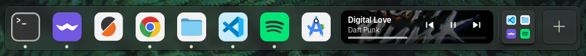
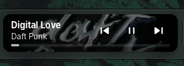

# Dock (elementary OS) - Now Playing Edition

[English](README.md) | [Espanol](README.es.md)

Fast app launcher and window switcher for Pantheon, with an integrated **Now Playing** widget in the dock.

## What This Project Is

This repository contains the elementary OS (Pantheon) dock, buildable from source, with a **Now Playing** implementation that lets you:

- See album art, title, and artist for currently playing media.
- Control `previous`, `play/pause`, and `next` directly from the dock.
- Use two visual modes: `Normal` (full card) and `Minimal` (cover-only with controls in tooltip).
- Show a subtle animated cover effect while media is playing (enabled by default, optional).
- Show a minimal seek bar/progress indicator and seek directly from the dock (enabled by default, optional).

The widget uses MPRIS, so it works with compatible players (for example Spotify, Rhythmbox, and others).

## Screenshots

### Normal Mode


### Minimal Mode


### Seek Bar



### Cover Animation



## Requirements

For elementary OS/Ubuntu builds:

- `meson`
- `ninja-build`
- `valac`
- `libgtk-4-dev`
- `libadwaita-1-dev`
- `libgranite-7-dev`
- `libsoup-3.0-dev`
- `libx11-dev`
- `libwayland-dev`

Install dependencies:

```bash
sudo apt update
sudo apt install -y \
  meson ninja-build valac \
  libgtk-4-dev libadwaita-1-dev libgranite-7-dev \
  libsoup-3.0-dev libx11-dev libwayland-dev
```

## Step-By-Step Installation (Recommended, User-Local)

### 1. Clone the repository

```bash
git clone https://github.com/Juandamian18/Dock-with-Now-Playing.git
cd Dock-with-Now-Playing
```

If you already cloned it:

```bash
git pull
```

### 2. Configure build directory

```bash
meson setup build --prefix=/usr
```

If `build` already exists:

```bash
meson setup build --reconfigure --prefix=/usr
```

### 3. Build

```bash
ninja -C build
```

### 4. Install this build only for your user (recommended)

This avoids touching system binaries and keeps an automatic backup:

```bash
set -euo pipefail
mkdir -p "$HOME/.local/bin" "$HOME/.local/bin/backups"

if [ -f "$HOME/.local/bin/io.elementary.dock" ]; then
  ts="$(date +%Y%m%d-%H%M%S)"
  cp -a "$HOME/.local/bin/io.elementary.dock" \
    "$HOME/.local/bin/backups/io.elementary.dock.$ts"
fi

install -m 0755 build/src/io.elementary.dock "$HOME/.local/bin/io.elementary.dock"
```

### 5. Restart the dock

```bash
pkill -f '^io.elementary.dock$' || true
```

The process should auto-start again.

### 6. Verify that your local binary is being used

```bash
which io.elementary.dock
```

Expected output:

```text
/home/your-user/.local/bin/io.elementary.dock
```

## Global Installation (Optional)

If you want to install system-wide:

```bash
sudo ninja -C build install
pkill -f '^io.elementary.dock$' || true
```

Note: this overwrites the package-installed binary and may be reverted by system updates.

## Using Now Playing

### Normal Mode

- Shown as a full card in the dock.
- Album-art background with dark overlay for text readability.
- Inline controls (`previous`, `play/pause`, `next`).
- Optional inline seek bar (progress + seeking).

### Minimal Mode

- Shows only square cover art at icon size.
- Hover opens tooltip with track info, controls, and optional seek bar.

How to enable it:

1. Start playback in a compatible player (so the Now Playing item appears in the dock).
2. Right click the Now Playing item (cover/card in the dock).
3. Click `Minimal Mode` in the context menu.

How to disable it:

1. Right click the Now Playing item again.
2. Click `Minimal Mode` to untoggle it.

### Context Menu Options

Right click the Now Playing item to toggle:

- `Minimal Mode`: cover-only icon + interactive tooltip.
- `Cover Animation`: subtle automatic cover movement while playing.
- `Seek Bar`: progress bar and scrubbing controls.

### Behavior

- If no compatible media player is active, Now Playing hides itself.
- If the player closes, the item disappears automatically.
- `Cover Animation` and `Seek Bar` are enabled by default and persisted in settings.

## Restore Original Dock

### Option A: remove local override

```bash
rm -f "$HOME/.local/bin/io.elementary.dock"
pkill -f '^io.elementary.dock$' || true
```

### Option B: restore latest local backup

```bash
latest_backup="$(ls -1t "$HOME/.local/bin/backups"/io.elementary.dock.* 2>/dev/null | head -n1)"
if [ -n "${latest_backup:-}" ]; then
  cp -a "$latest_backup" "$HOME/.local/bin/io.elementary.dock"
  pkill -f '^io.elementary.dock$' || true
fi
```

## Development

Build after changes:

```bash
ninja -C build
```

Run tests (if your environment includes them):

```bash
ninja -C build test
```

Lint (same as CI):

```bash
io.elementary.vala-lint -d .
```

## Relevant Project Structure

- `src/MediaSystem/NowPlayingItem.vala`: Now Playing UI and behavior.
- `src/MediaSystem/MediaMonitor.vala`: MPRIS integration and playback state.
- `src/ItemManager.vala`: item integration in dock layout.
- `data/Application.css`: dock and widget styles.
- `data/dock.gschema.xml`: settings keys (includes minimal mode, cover animation, and seek bar).

## License

Distributed under **GPL-3.0**. See [LICENSE](LICENSE).
